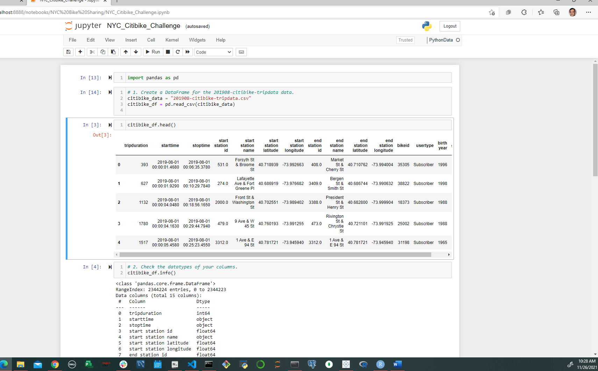
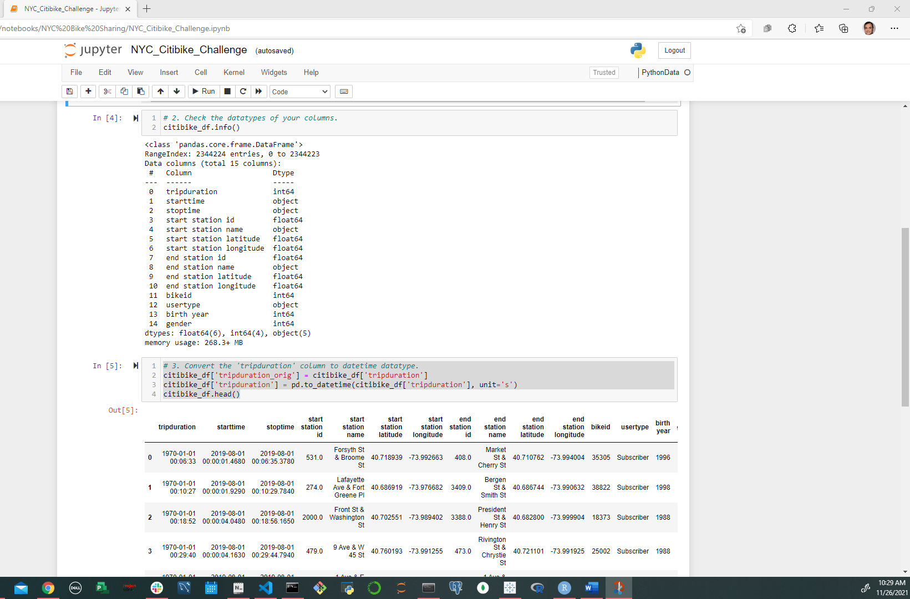
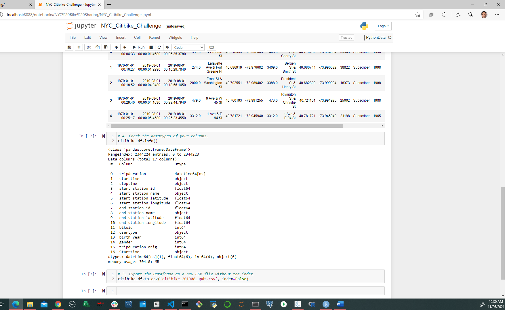
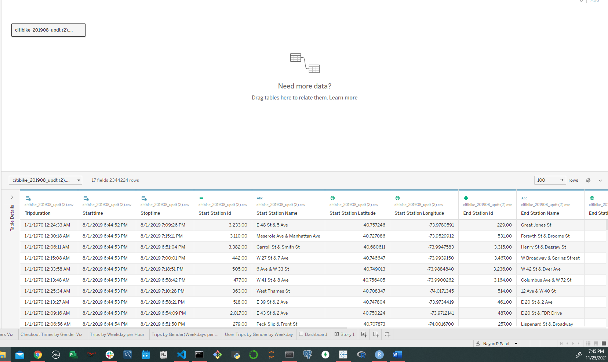
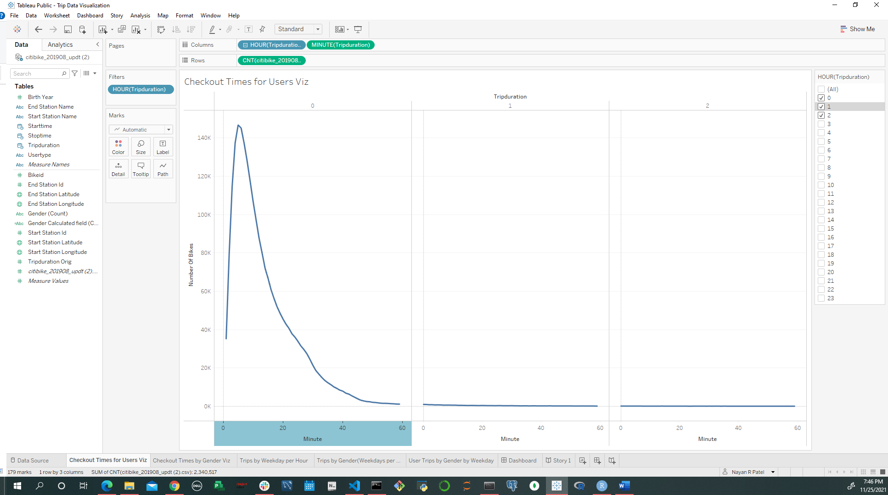
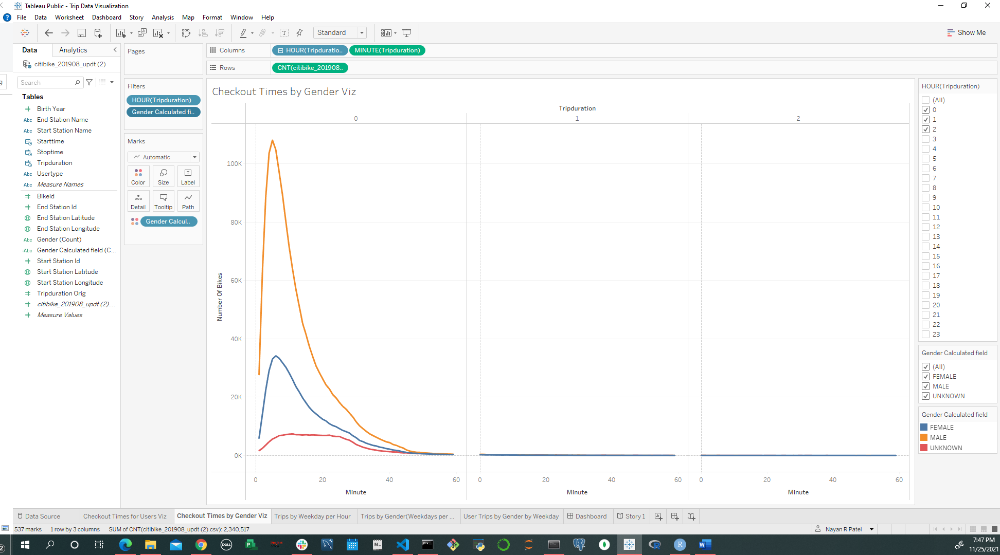
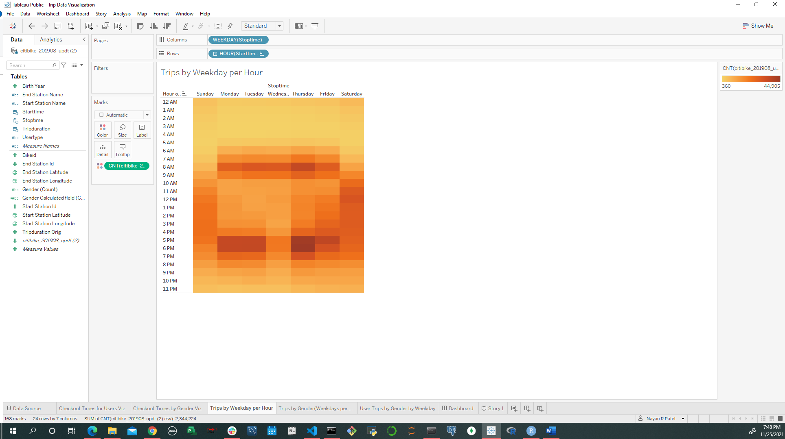
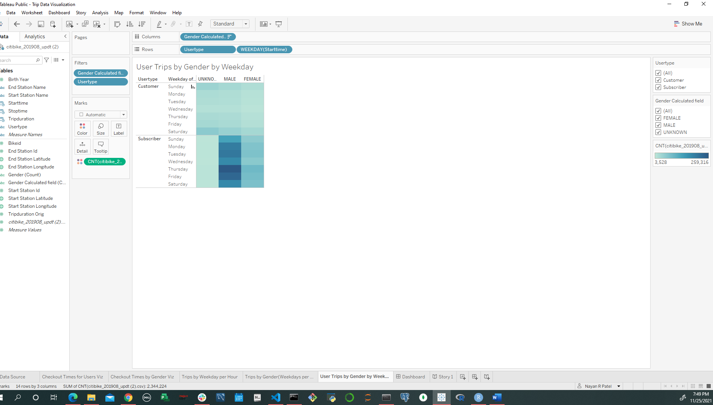
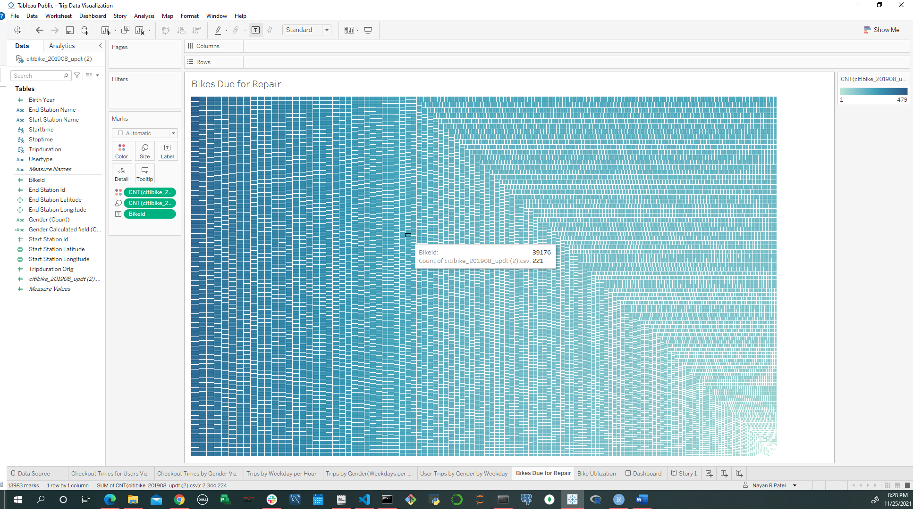
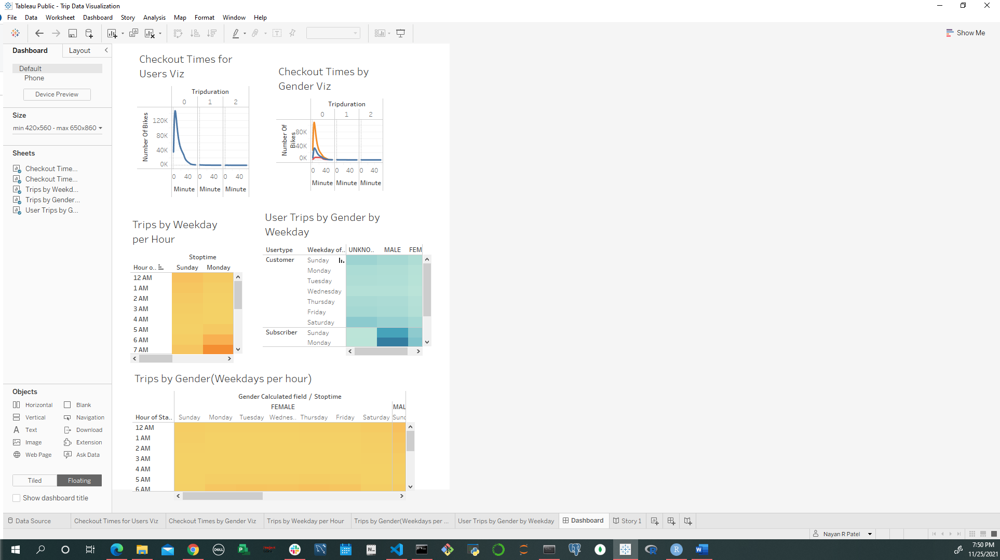

<<<<<<< HEAD
# bikesharing

## Overview of Project

Citibike data is distributed in many locations across the city, there are many bikes in service, and it is the largest bike-sharing system in the United States.
As many people who also commutes mainly by biking, three out of five participants who I talk to uses Citi bike service and are annual subscribers.

Preliminary user research questions:

1. Do you use Citi bike service on a regular basis?

2. On average, what is your pattern of usage?

3. What is your source of information about the availability of bikes throughout the day?

Results of Preliminary user research findings:

1. A visualization that would show patterns of usage throughout the day is something they envision that could help with understanding.

2. Participants use the service most regularly on weekdays to commute and also use the service during the weekend for short distant commute.

3. Most participants benefit from the live station map provided by the Citi bike app. The live map shows the number of bikes and empty docks available at each station in real time. They use the map to locate the nearest station and availability of bikes or docks.

## Resources:

Program used: Python, pandas, Tableau, Jupyter Notebook, CSV, Tableau and Visual Studio

Data Source: NYC-201908-citibike-tripdata.csv

# Deliverable 1: 

1. Using Python and Pandas functions, converted the "tripduration" column from an integer to a datetime datatype to get the time in hours, minutes, and seconds (00:00:00).
2. Export the DataFrame as a CSV file to use for the trip analysis in Deliverable 2.

## Deliverable 2:

Create Visualizations for the Trip Analysis

Herre ar created visulaization considering different tools in tableau:

Deliverable 3:

Story and Report for the Final Presentation:

## Dashboard:

[link to dashboard](https://public.tableau.com/app/profile/nayan.patel2784/viz/TripDataVisualization-NYCCityBikeDashboard/Dashboard?publish=yes)

## Story Points and Summary:

The Citi Bike System Data page describes the information provided. The specific information for each ride is:
Trip Duration (seconds)
Start Time and Date
Stop Time and Date
Start Station Name
End Station Name
Station ID
Station Lat/Long
Bike ID
User Type 
Gender (Zero=unknown; 1=male; 2=female)
Year of Birth

## Conclusion:
The Citi Bike trip data, while useful for analysis as provided, can be made more so with some data preparation to add additional columns with more or less detail. Pandas provides the data structures and operations to facilitate data preparation and Seaborn makes it very easy to produce distribution charts to understand the data. Jupyter Notebook provides a convenient way to document the preparation steps used.

=======
# bikesharing

## Overview of Project

Citibike data is distributed in many locations across the city, there are many bikes in service, and it is the largest bike-sharing system in the United States.
As many people who also commutes mainly by biking, three out of five participants who I talk to uses Citi bike service and are annual subscribers.

Preliminary user research questions:

1. Do you use Citi bike service on a regular basis?

2. On average, what is your pattern of usage?

3. What is your source of information about the availability of bikes throughout the day?

Results of Preliminary user research findings:

1. A visualization that would show patterns of usage throughout the day is something they envision that could help with understanding.

2. Participants use the service most regularly on weekdays to commute and also use the service during the weekend for short distant commute.

3. Most participants benefit from the live station map provided by the Citi bike app. The live map shows the number of bikes and empty docks available at each station in real time. They use the map to locate the nearest station and availability of bikes or docks.

## Resources:

Program used: Python, pandas, Tableau, Jupyter Notebook, CSV, Tableau and Visual Studio

Data Source: NYC-201908-citibike-tripdata.csv

# Deliverable 1: 

1. Using Python and Pandas functions, converted the "tripduration" column from an integer to a datetime datatype to get the time in hours, minutes, and seconds (00:00:00).
2. Export the DataFrame as a CSV file to use for the trip analysis in Deliverable 2.

## Deliverable 2:

Create Visualizations for the Trip Analysis

Herre ar created visulaization considering different tools in tableau:

Deliverable 3:

Story and Report for the Final Presentation:

## Dashboard:

[link to dashboard](https://public.tableau.com/app/profile/nayan.patel2784/viz/TripDataVisualization-NYCCityBikeDashboard/Dashboard?publish=yes)

## Story Points and Summary:

The Citi Bike System Data page describes the information provided. The specific information for each ride is:
Trip Duration (seconds)
Start Time and Date
Stop Time and Date
Start Station Name
End Station Name
Station ID
Station Lat/Long
Bike ID
User Type 
Gender (Zero=unknown; 1=male; 2=female)
Year of Birth

## Conclusion:
The Citi Bike trip data, while useful for analysis as provided, can be made more so with some data preparation to add additional columns with more or less detail. Pandas provides the data structures and operations to facilitate data preparation and Seaborn makes it very easy to produce distribution charts to understand the data. Jupyter Notebook provides a convenient way to document the preparation steps used.

